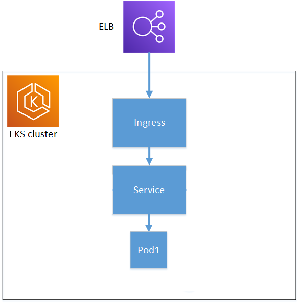

# k8s Restful Service

## Purpose

### Move restful API from on prem to AWS EKS

## Architecture Diagram

## Common Stack

* Git
* GitHub Actions

## IAC Stack

* AWS
* Terraform 

## Rest Service Stack

* NodeJS

## k8s setup

* IAC
* Cluster per environment
  * Stood up via terraform
  * Workspaces manage environments/clusters

## Restful Service

* Stated requirement of message and timestamp
* Information call which provides
  * Version of service
  * Environment derived from AWS/k8s

## Deployment

* GitHub Flow
  * Main branch is production
  * Can be converted to GitFlow by creating a second long running branch
* Automated environment validation test

## Useful Links

* [Plan of Attack](docs/attack-plan.md)
* [Architecture Diagram](docs/architecture.png)